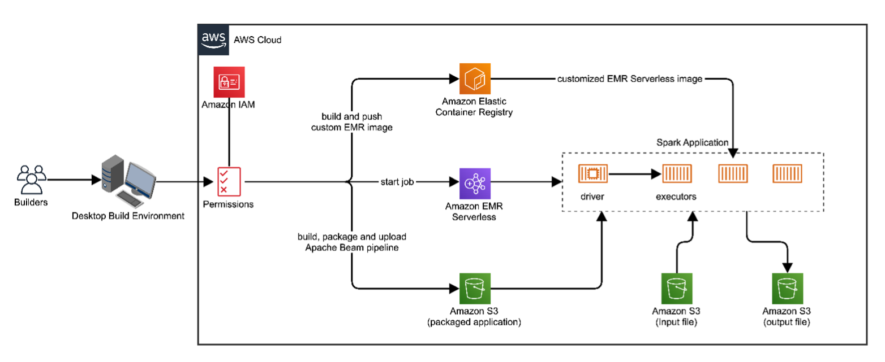

# Run Apache Beam Python Spark Pipelines on Amazon EMR Serverless  

In today's data-driven world, organizations across various industries face the challenge of efficiently processing and analyzing large volumes of data. Many are looking at managing real-time streaming and batch processing using a unified runtime as provided in Apache Beam.  

Customer are beginning to build amorphous pipelines which provides unified interface for ingesting, storing, processing and analyzing large volumes of data from various batch and real-time sources. [Apache Beam (Beam)](https://beam.apache.org/get-started/beam-overview/), provides such a flexible programming model for building batch and streaming data processing pipelines. When integrated with [Amazon EMR Serverless](https://aws.amazon.com/emr) together they provide a comprehensive cloud-based solution for petabyte-scale data processing, interactive analytics, and machine learning. 

With Beam, developers can write code once and run it on various execution engines, such as [Apache Spark](https://spark.apache.org/) and [Apache Flink](https://flink.apache.org/). This flexibility allows organizations to leverage the strengths of different execution engines while maintaining a consistent codebase, reducing the complexity of managing multiple codebases and minimizing the risk of vendor lock-in.  

Organizations can then use Amazon EMR Serverless to leverage flexible and scalable computing. With EMR Serverless, infrastructure is automatically provisioned and managed, allowing teams to focus on building and deploying data processing pipelines instead of managing resources. Amazon EMR Serverless also integrates with other AWS services, empowering organizations to create end-to-end data processing workflows on the AWS Cloud.  

In this blog, we provide a step-by-step walkthrough on how to set up and run Apache Beam Python pipelines on Amazon EMR Serverless.

## Solution overview

This post provides a walkthrough of the steps required to configure, build, package, and deploy Apache Beam pipelines targeting the Spark runtime on Amazon EMR Serverless. We demonstrate this by outlining a series of tasks using the AWS command line interface (CLI). The Beam [wordcount](https://github.com/apache/beam/blob/master/sdks/python/apache_beam/examples/wordcount.py) example pipeline provided on the [Beam Github repo](https://github.com/apache/beam/blob/master/sdks/python/apache_beam) is use to illustrate the steps and requirements. The architecture below shows the minimum components required to run Beam on Amazon EMR Serverless.

By following the steps in this post, you will create a build environment, configure the proper access to the AWS cloud, package the example Beam Python, create a customized Amazon EMR Serverless image, deploy the image to Amazon ECR, use it as the runtime environment for executing the packaged Beam pipeline and monitor and validate the success.

The below diagram provides a service view of the implementation architecture.

## Prerequisites

To follow along, you should have the following:

* AWS Account—You must have an active AWS account before you proceed. If you don't have one, refer to the guide [on how to create and activate one.](https://aws.amazon.com/premiumsupport/knowledge-center/create-and-activate-aws-account/).

* An IAM user – You will need a dedicated non-administrative user with command line access to the AWS account to follow along in this walkthrough. Follow these steps to [create an IAM user](https://docs.aws.amazon.com/IAM/latest/UserGuide/id_users_create.html) with command line access. Name this user beam-blog-user.  

* An IAM policy – You must create and attach an IAM policy to the dedicated non-administrative user.  For the purpose of this blog, name this policy beam-blog-policy.

* [AWS Command Line Interface (CLI)](https://docs.aws.amazon.com/cli/latest/userguide/getting-started-install.html) – You must set and [configure](https://docs.aws.amazon.com/cli/latest/userguide/cli-chap-configure.html)  the CLI with a default profile.

* [Docker client](https://docs.docker.com/engine/install/) – You will need the Docker client to build the custom Amazon EMR serverless container image.

* [Python](https://realpython.com/installing-python/) – As shown in the table below, you will need a compatible Python version.
* Ability to run commands in a Linux terminal.

The table below shows the compatibility matrix.  These versions were tested and found to be compatible. In this walkthrough, we used Python 3.11, Apache Beam 2.58.0, and EMR Serverless 7.5:

| Python versions | Apache Beam Versions | EMR Versions |
|----------------|---------------------|--------------|
| 3.8.x | 2.50.0 thru 2.58.0 | 6.13.0 thru 6.15.0 |
| 3.9.x | 2.50.0 thru 2.58.0 | 6.13.0 thru 6.15.0 |
| 3.10.x | 2.50.0 thru 2.58.0 | 6.13.0 thru 6.15.0 |
| 3.11.x | 2.50.0 thru 2.58.0 | 6.13.0 thru 6.15.0 |
| 3.11.x | 2.50.0 thru 2.58.0 | 7.x |

The solution builds a custom Amazon EMR serverless Spark image that allows Apache Beam pipelines to run. This is demonstrated by packaging and running the example Beam wordcount pipeline on EMR Serverless and reviewing the outputs. You must download the example pipeline and the input data into your working folder.

Create and attach the required AWS policy to the non-admin beam-blog-user

As the pre-requisite administrative user, use the below policy document to create a beam-blog-policy and attach it to the pre-requisite non-administrative user, beam-blog-user:

{

    "Version": "2012-10-17",

    "Statement": [

        {

            "Sid": "ECRAccess",

            "Effect": "Allow",

            "Action": [

                "ecr:CreateRepository",

                "ecr:DeleteRepository",

                "ecr:SetRepositoryPolicy",

                "ecr:GetAuthorizationToken"

            ],

            "Resource": "arn:aws:ecr:us-east-1:*:repository/beam-blog-repo"

        },

        {

            "Sid": "ECRPublicAccess",

            "Effect": "Allow",

            "Action": "ecr-public:GetAuthorizationToken",

            "Resource": "*"

        },

        {

            "Sid": "EMRServerlessAccess",

            "Effect": "Allow",

            "Action": [

                "emr-serverless:GetDashboardForJobRun",

                "emr-serverless:CreateApplication",

                "emr-serverless:StartJobRun",

                "emr-serverless:StopApplication",

                "emr-serverless:DeleteApplication",

                "emr-serverless:GetJobRun"

            ],

            "Resource": "*"

        },

        {

            "Sid": "EMRServerlessServiceLinkedRole",

            "Effect": "Allow",

            "Action": "iam:CreateServiceLinkedRole",

            "Resource": "arn:aws:iam::*:role/aws-service-role/emr-serverless.amazonaws.com/*",

            "Condition": {

                "StringLike": {

                    "iam:AWSServiceName": "emr-serverless.amazonaws.com"

                }

            }

        },

        {

            "Sid": "IAMAccess",

            "Effect": "Allow",

            "Action": [

                "iam:CreatePolicy",

                "iam:DeletePolicy",

                "iam:CreateRole",

                "iam:AttachUserPolicy",

                "iam:DetachUserPolicy",

                "iam:DeleteRole",

                "iam:AttachRolePolicy",

                "iam:DetachRolePolicy"

            ],

            "Resource": [

                "arn:aws:iam:::role/beam-blog*",

                "arn:aws:iam:::policy/beam-blog*"

            ]

        },

        {

            "Sid": "S3Access",

            "Effect": "Allow",

            "Action": [

                "s3:PutObject",

                "s3:GetObject",

                "s3:CreateBucket",

                "s3:ListBucket",

                "s3:DeleteObject",

                "s3:DeleteBucket"

            ],

            "Resource": [

                "arn:aws:s3:::*-beam-blog-bucket/*",

                "arn:aws:s3:::*-beam-blog-bucket"

            ]

        },

        {

            "Sid": "STSAccess",

            "Effect": "Allow",

            "Action": "sts:GetServiceBearerToken",

            "Resource": "*"

        }

    ]

}

Setup build environment

The built environment is a local folder on a computer with all prerequisites and a Python virtual environment with the Beam SDK installed. When completed, the steps and instructions below create the build environment. 

You will use the  and terminal commands for the rest of the walk-through. All commands should be run in a single terminal window, as sequenced in these steps, as session environment variables store values.

Initialize session environment variables

Run the commands below to set environment variables for the AWS account ID and build environment hardware architecture.  The hardware architecture must match the targeted EMR serverless runtime (i.e. X86-64 to X86-64 and ARM64 to ARM64).  Note that Mac silicon may return aarch64, which is replaceable by arm64 for this walkthrough.  The command below handles this substitution and stores the AWS account ID in the ACCOUNT_ID variable.  You can always see the variable's value by running “echo $variablename.”  For example, echo $ACCOUNT_ID will print out the value of the account ID.

ARCHITECTURE=$(uname -m | awk '{print toupper($0)}')

if [[ "$ARCHITECTURE" == "AARCH"* ]]; then

ARCHITECTURE="ARM64"

fi

ACCOUNT_ID=$(aws sts get-caller-identity --output text --query Account)

Create a working directory and Amazon S3 bucket

Run the commands below to create a working directory and change it into the created directory. Then, make a bucket in your AWS account to upload the example Beam pipeline application, input file, and output from the pipeline execution.

mkdir beam-demo && cd beam-demo

aws s3 mb s3://${ACCOUNT_ID}-beam-blog-bucket --region us-east-1

Create a virtual Python environment

Run the commands below to create, activate, and install build requirements in a virtual Python environment. This step is important as it provides dependencies isolation between Beam requirements and those of the default EMR Serverless Python configuration.

python3 -m venv build-environment && \
source build-environment/bin/activate && \
python3 -m pip install --upgrade pip && \
python3 -m pip install apache_beam==2.58.0 \
    s3fs \
    boto3

Package example Beam pipeline

This section outlines the steps to build, package, and deploy the example Apache Beam wordcount pipeline. EMR Serverless allows the deployment and execution of Hive and Spark applications, and Apache Beam allows targeting multiple runtime environments. We use the  example and target the Spark runtime on EMR.

Build, package, and deploy Beam pipeline with dependencies

Download the  example program and the sample input file, from your local beam-demo directory. The wordcount Python example demonstrates an Apache Beam pipeline with the following stages: read files, split words, map, group, and sum word counts, and write output to files.  The command below downloads these required files.

curl -O 

curl -O 

aws s3 cp kinglear.txt s3://${ACCOUNT_ID}-beam-blog-bucket/

To run an Apache Beam Python pipeline on EMR Serverless, the pipeline must be packaged with all its dependencies into a single jar file called “fat jar.” Use the below command to create a fat jar for the wordcount pipeline. We use the wordcount example “as-is”. The command uses the ACCOUNT_ID environment variable to resolve the bucket created in the previous step dynamically. Once the wordcountApp.jar is made, the generated file is uploaded to the S3 bucket.

python3 wordcount.py --output_executable_path=./wordcountApp.jar \
--runner=SparkRunner \
--environment_type=PROCESS \
--environment_config='{"command":"/opt/apache/beam/boot"}' \
--input=s3://${ACCOUNT_ID}-beam-blog-bucket/kinglear.txt \
--output=s3://${ACCOUNT_ID}-beam-blog-bucket/output.txt

aws s3 cp wordcountApp.jar s3://${ACCOUNT_ID}-beam-blog-bucket/app/

Create and deploy custom EMR Serverless image to Amazon ECR

To create, build, and use a custom Amazon EMR Serverless image, it is necessary to have a private repository in Amazon ECR (Elastic Container Registry). This private ECR repository will store your custom EMR Serverless container images, which are required for EMR Serverless to access and execute your specific configurations and dependencies. By setting up and using an ECR private repository, you can securely manage, version, and deploy custom images tailored for your EMR Serverless applications.

Create a repository named beam-blog-repo.

aws ecr create-repository --repository-name beam-blog-repo --region us-east-1

Create and attach a trust policy for the Amazon Elastic Container Registry (Amazon ECR) that provides the permissions needed to upload and access the custom EMR serverless image.

aws ecr set-repository-policy --repository-name beam-blog-repo --region us-east-1  --policy-text '{

    "Version": "2008-10-17",

    "Statement": [

      {

        "Sid": "allow pull and push",

        "Effect": "Allow",

        "Principal": {"AWS":"*"},

        "Action": [

          "ecr:GetDownloadUrlForLayer",

          "ecr:BatchGetImage",

          "ecr:DescribeImages",

          "ecr:BatchCheckLayerAvailability",

          "ecr:PutImage",

          "ecr:InitiateLayerUpload",

          "ecr:UploadLayerPart",

          "ecr:CompleteLayerUpload"

        ]

      }

    ]

  }' --force

Authenticate the Docker client to the Amazon ECR service by running the below command.  This is required when you are accessing private repositories.

aws ecr get-login-password --region us-east-1 | docker login --username AWS --password-stdin ${ACCOUNT_ID}.dkr.ecr.us-east-1.amazonaws.com

Run the below command to create a Docker build file, Dockerfile, in the working directory.  The file uses EMR serverless spark version 7.4 as its base image.  It compiles Python 3.11.10 from source, creates a Python virtual environment, install Beam SDK 2.58.0, like the one in the build environment, and sets the virtual environment as the default runtime environment. In Apache Beam 2.44.0 and later, workers create a virtual environment when starting a custom container. If the container creates its own virtual environment to install dependencies, those dependencies are discarded. It is important to activate the Beam environment in your container image by setting the RUN_PYTHON_SDK_IN_DEFAULT_ENVIRONMENT=1:

echo 'FROM public.ecr.aws/emr-serverless/spark/emr-6.15.0:latest

USER root

ARG PYTHON_VERSION=3.11.10

ARG BEAM_VERSION=2.58.0

RUN yum install -y gcc openssl11-devel xz-devel lzma liblzma-dev libbz2-dev bzip2-devel libffi-devel tar gzip wget make && \

    wget https://www.python.org/ftp/python/${PYTHON_VERSION}/Python-${PYTHON_VERSION}.tgz && \

    tar xzf Python-${PYTHON_VERSION}.tgz && \

    cd Python-${PYTHON_VERSION} && \

    ./configure --enable-optimizations && \

    make install

 

ENV VIRTUAL_ENV=/opt/venv

RUN python3 -m venv $VIRTUAL_ENV --copies

RUN cp -r /usr/local/lib/python3.11/* $VIRTUAL_ENV/lib/python3.11 

ENV PATH="$VIRTUAL_ENV/bin:$PATH"

 

RUN python3 -m pip install --upgrade pip && \

    python3 -m pip install apache_beam==${BEAM_VERSION} \

    s3fs \

    boto3

 

ENV PYSPARK_PYTHON="/opt/venv/bin/python3"

ENV PYSPARK_DRIVER_PYTHON="/opt/venv/bin/python3"

ENV RUN_PYTHON_SDK_IN_DEFAULT_ENVIRONMENT=1

COPY --from=apache/beam_python3.11_sdk:2.58.0 /opt/apache/beam /opt/apache/beam

USER hadoop:hadoop' > Dockerfile

Once the Dockerfile file is created, run the commands below to build, tag, and upload the custom image to the ECR repository. The first command uses the Docker client to build a custom EMR serverless container image, and the next command uploads the custom image to ECR, where it is accessible privately in the AWS account:

docker build . --tag ${ACCOUNT_ID}.dkr.ecr.us-east-1.amazonaws.com/beam-blog-repo:blog-image

docker push ${ACCOUNT_ID}.dkr.ecr.us-east-1.amazonaws.com/beam-blog-repo:blog-image

Create an EMR serverless application using the custom image

After the Beam pipeline is packaged and uploaded to Amazon S3 and the customized EMR serverless image is uploaded to Amazon ECR, we are ready to create and configure a serverless application where the pipeline will be deployed and run.  The steps required are building an application referencing the custom image, creating an EMR serverless runtime role with the required permissions to access resources needed, and launching and monitoring the application.

Create an EMR serverless application

Copy and run the text below in the terminal to create an EMR serverless application applicable to building hardware architecture in your AWS account.  The JSON configuration is assigned to a variable, APP_TEXT, to allow dynamic replacement for your environment ACCOUNT_ID and ARCHITECTURE that was set earlier:

echo '{
       "name": "app-beam-blog",
       "releaseLabel": "emr-6.15.0",
       "type": "Spark",
       "initialCapacity": {
           "DRIVER": {
               "workerCount": 2,
               "workerConfiguration": {
                   "cpu": "2vCPU",
                   "memory": "10GB",
                   "disk":"20 GB"
               }
           },
           "EXECUTOR": {
               "workerCount": 2,
               "workerConfiguration": {
                   "cpu": "2vCPU",
                   "memory": "10GB",
                   "disk": "32 GB"
               }            
           }
       },
       "maximumCapacity": {
           "cpu": "200vCPU",
           "memory": "200GB",
           "disk": "500GB"   
       },
       "architecture": "ARCHITECTURE_PLACEHOLDER",
       "imageConfiguration": {
           "imageUri": "ACCOUNT_ID_PLACEHOLDER.dkr.ecr.us-east-1.amazonaws.com/beam-blog-repo:blog-image"
       },
       "autoStartConfiguration": {
           "enabled": true
       },
       "autoStopConfiguration": {
           "enabled": true,
           "idleTimeoutMinutes": 60
       }
}' > application.json

if [[ "$OSTYPE" == "darwin"* ]]; then

    sed -i '' "s/ARCHITECTURE_PLACEHOLDER/$ARCHITECTURE/g" application.json

    sed -i '' "s/ACCOUNT_ID_PLACEHOLDER/$ACCOUNT_ID/g" application.json

else

    sed -i "s/ARCHITECTURE_PLACEHOLDER/$ARCHITECTURE/g" application.json

    sed -i "s/ACCOUNT_ID_PLACEHOLDER/$ACCOUNT_ID/g" application.json

fi

Create the Amazon EMR Serverless application using the application.json.  The created APPLICATION_ID is saved into a variable for use in subsequent steps.

APPLICATION_ID=$(aws emr-serverless create-application --cli-input-json file://application.json --output text --query applicationId --region us-east-1)

Run the command below to copy the below JSON text into a file named emrtrustpolicy.json.  The trust policy is used to create the EMR runtime role named beam-blog-emrserverless-role:

echo '{
       "Version": "2012-10-17",
       "Statement": [
           {
               "Sid": "ServerlessTrustPolicy",
               "Effect": "Allow",
               "Principal": {
                   "Service": "emr-serverless.amazonaws.com"
               },
               "Action": "sts:AssumeRole"
           }
       ]
}' > emrtrustpolicy.json && \

aws iam create-role --assume-role-policy-document file://emrtrustpolicy.json  --role-name beam-blog-emrserverless-role --region us-east-1

Create and attach two policies to the runtime role.  The policies will allow the runtime role access to Amazon S3 and CloudWatch logs.  In a production environment, policies and permissions should follow the :

echo '{
  "Version": "2012-10-17",
  "Statement": [
    {
      "Effect": "Allow",
      "Action": [
                "s3:PutObject","s3:GetObject",
                "s3:CreateBucket","s3:ListBucket","s3:DeleteObject","s3:DeleteBucket"],
      "Resource": [
        "arn:aws:s3:::ACCOUNT_ID-beam-blog-bucket",
        "arn:aws:s3:::ACCOUNT_ID-beam-blog-bucket/*"
      ]
    }
  ]
}' > s3policy.json

if [[ "$OSTYPE" == "darwin"* ]]; then

sed -i '' "s/ACCOUNT_ID/$ACCOUNT_ID/g" s3policy.json

else

sed -i "s/ACCOUNT_ID/$ACCOUNT_ID/g" s3policy.json

fi

aws iam create-policy \
    --policy-name beam-blog-runtime-policy \
    --policy-document file://s3policy.json

aws iam attach-role-policy --role-name beam-blog-emrserverless-role --region us-east-1  --policy-arn arn:aws:iam::${ACCOUNT_ID}:policy/beam-blog-runtime-policy

Create and attach CloudWatch policy to runtime role:

echo '{
    "Version": "2012-10-17",
    "Statement": [
        {
            "Effect": "Allow",
            "Action": [
                "logs:CreateLogGroup","logs:CreateLogStream",
                "logs:PutLogEvents","logs:DescribeLogGroups",
                "logs:DescribeLogStreams","logs:GetLogEvents",
                "logs:FilterLogEvents","logs:DeleteLogGroup","logs:DeleteLogStream",
                "logs:PutRetentionPolicy","logs:DeleteRetentionPolicy"
            ],
            "Resource":"arn:aws:logs:us-east-1:ACCOUNT_ID:log-group:beam-blog:*:*"
        }
    ]
}' > cloudWatchpolicy.json

if [[ "$OSTYPE" == "darwin"* ]]; then

sed -i '' "s/ACCOUNT_ID/$ACCOUNT_ID/g" cloudWatchpolicy.json

else

sed -i "s/ACCOUNT_ID/$ACCOUNT_ID/g" cloudWatchpolicy.json

fi

aws iam create-policy \
    --policy-name beam-blog-cloudwatch-policy \
    --policy-document file://cloudWatchpolicy.json

aws iam attach-role-policy --role-name beam-blog-emrserverless-role --region us-east-1  --policy-arn arn:aws:iam::${ACCOUNT_ID}:policy/beam-blog-cloudwatch-policy

Create and attach an “iam:PassRole” policy to the AWSCloud9SSMAccessRole to allow it to pass the runtime role when it starts a serverless job:

echo '{
    "Version": "2012-10-17",
    "Statement": [
        {
            "Sid": "VisualEditor4",
            "Effect": "Allow",
            "Action": "iam:PassRole",
            "Resource": "arn:aws:iam::ACCOUNT_ID:role/beam-blog-emrserverless-role"
        }
    ]
}' > beamBlogPassRolePolicy.json

if [[ "$OSTYPE" == "darwin"* ]]; then

sed -i '' "s/ACCOUNT_ID/$ACCOUNT_ID/g" beamBlogPassRolePolicy.json

else

sed -i "s/ACCOUNT_ID/$ACCOUNT_ID/g" beamBlogPassRolePolicy.json

fi

aws iam create-policy \
    --policy-name beam-blog-pass-role-policy \
    --policy-document 

aws iam attach-user-policy --user-name beam-blog-user --region us-east-1  --policy-arn arn:aws:iam::${ACCOUNT_ID}:policy/beam-blog-pass-role-policy

The command below dynamically sets the location of the packaged fatJar using environment variables. The packaged pipeline is then executed on the EMR Serverless application by starting the job. The initial submission of the job will take about 5 minutes.

ENTRYPOINT='{
"sparkSubmit": {
"entryPoint": "s3://ACCOUNT_ID-beam-blog-bucket/app/wordcountApp.jar",
               "sparkSubmitParameters": "--verbose --class org.apache.beam.runners.spark.SparkPipelineRunner --conf spark.emr-serverless.driverEnv.PYSPARK_DRIVER_PYTHON=/opt/venv/bin/python3 --conf spark.emr-serverless.driverEnv.PYSPARK_PYTHON=/opt/venv/bin/python3 --conf spark.executorEnv.PYSPARK_PYTHON=/opt/venv/bin/python3"}
}'
ENTRYPOINT=${ENTRYPOINT/ACCOUNT_ID/$ACCOUNT_ID}
JOBRUN_ID=$(aws emr-serverless start-job-run \
--application-id $APPLICATION_ID \
--execution-role-arn arn:aws:iam::${ACCOUNT_ID}:role/beam-blog-emrserverless-role \
--region us-east-1 \
--job-driver "${ENTRYPOINT}" --output text --query jobRunId)

The below command uses the AWS CLI to monitor the status of the submitted job.  When the job status is RUNNING, it outputs to the terminal windows a secure URL to access the Spark history server, where you can visually see details about the execution:

JOBSTATUS=$(aws emr-serverless get-job-run --application-id=$APPLICATION_ID --job-run-id=$JOBRUN_ID --region=us-east-1 --output text --query jobRun.state)

while [[ "$JOBSTATUS" != "RUNNING" && "$JOBSTATUS" != "SUCCESS" ]]; do

    sleep 5

    JOBSTATUS=$(aws emr-serverless get-job-run --application-id=$APPLICATION_ID --job-run-id=$JOBRUN_ID --region=us-east-1 --output text --query jobRun.state)

    echo $JOBSTATUS

done

echo $JOBSTATUS

URL=$( aws emr-serverless get-dashboard-for-job-run --application-id $APPLICATION_ID --job-run-id $JOBRUN_ID --region us-east-1 --output text --query url)

echo $URL

Monitor job run and output

Click on the URL to open the Spark History Server:

Once the job completes successfully, the output files (output.txt-*) containing words found in the input text and the count of each occurrence can be downloaded from the S3 bucket by running the below commands to copy the outputs to your build environment:

aws s3 ls s3://$ACCOUNT_ID-beam-blog-bucket/ 

Cleanup and delete AWS resources

In this walkthrough, you created the following objects:

Amazon IAM User

Amazon IAM Policies

Amazon EMR serverless application

Amazon S3 bucket

Amazon ECR private repository

EMR serverless runtime role

You can clean up objects created to avoid running costs by having the administrative user execute the commands below in the given order. This can be done in AWS CloudShell. Additionally, have the administrative user  the beam-blog-user. However, if you wish to test-drive the second part of this blog, Run Apache Beam Python Spark Pipelines on Amazon EMR on EKS, do not run the cleanup now as steps from this walkthrough are used:

aws iam detach-user-policy \
  --user-name beam-blog-user --region us-east-1 \
  --policy-arn arn:aws:iam::${ACCOUNT_ID}:policy/beam-blog-pass-role-policy

aws iam detach-role-policy \
  --role-name beam-blog-emrserverless-role --region us-east-1 \
  --policy-arn arn:aws:iam::${ACCOUNT_ID}:policy/beam-blog-runtime-policy

aws iam detach-role-policy \
  --role-name beam-blog-emrserverless-role --region us-east-1 \
  --policy-arn arn:aws:iam::${ACCOUNT_ID}:policy/beam-blog-cloudwatch-policy

aws iam detach-user-policy \
  --user-name beam-blog-user --region us-east-1  \
  --policy-arn arn:aws:iam::${ACCOUNT_ID}:policy/beam-blog-policy

aws iam delete-role --role-name beam-blog-emrserverless-role --region us-east-1 

aws iam delete-policy --policy-arn arn:aws:iam::${ACCOUNT_ID}:policy/beam-blog-pass-role-policy

aws iam delete-policy --policy-arn arn:aws:iam::${ACCOUNT_ID}:policy/beam-blog-runtime-policy 

aws iam delete-policy --policy-arn arn:aws:iam::${ACCOUNT_ID}:policy/beam-blog-cloudwatch-policy 

aws ecr delete-repository --repository-name beam-blog-repo --region us-east-1 --force 

aws s3 rb s3://$ACCOUNT_ID-beam-blog-bucket --region us-east-1 --force 

aws emr-serverless stop-application --application-id $APPLICATION_ID --region us-east-1

aws emr-serverless delete-application --application-id $APPLICATION_ID --region us-east-1

Conclusion and next steps

This post demonstrates how to package and run Apache Beam pipelines in Python on Amazon EMR Serverless. While this post focuses on a simple batch processing pipeline, the critical value proposition highlighted in the post is the ability to leverage the flexibility of Apache Beam pipelines while taking advantage of the serverless nature and scalability of EMR Serverless, simplifying the management of the underlying infrastructure. Additionally, the blog took a programmatic approach using the AWS CLI and Bash scripting targeting data engineers. It provided animated screens and comments, targeting those new to the AWS Cloud. 

The second part of this blog walks you through running Apache Beam on Amazon EMR on EKS.  You can also explore the Apache Beam streaming workflow on AWS Managed Service for Apache Flink, which demonstrates how to run Apache Beam with Flink on Amazon EMR.

If you have any questions or feedback, please leave a comment. Check AWS  for additional discussions and answers to your questions.

Authors Bio

Bo Guan is a Sr. Solutions Architect at AWS, helping customers build, migrate, and manage their workloads on AWS. He is passionate about Containers, Observability, and Application Modernization.

Sebastian Muah is an AWS Sr. Specialist Solutions Architect focused on analytics, AI/ML, and big data. He has over 25 years of experience in information technology and helps customers architect and build highly scalable, performant, and secure cloud-based solutions on AWS.

